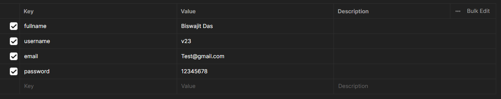
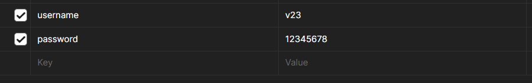
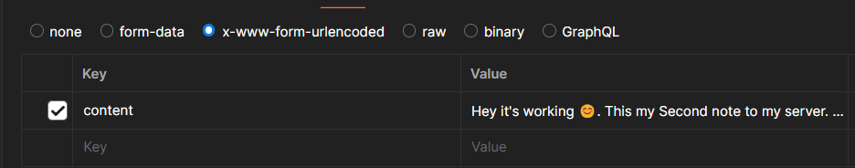
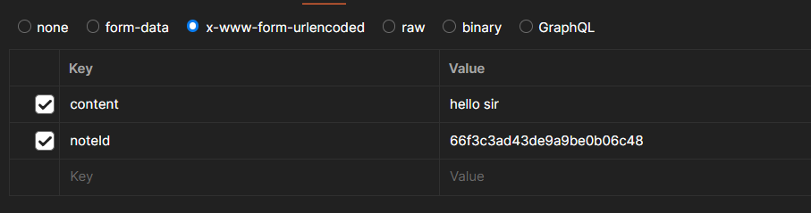

# Backend-service (SIMPAL NOTES TAKING APPLICATION)

This is a simple backend project. It is only use full for new frontend developer. Who's are don't know the backend. but need a taste of the backned.

### Why we use this

Because this backend application learnt you, How to handel REST API request and response in frontend.

# Tech stack

```
1. Node JS.
2. Express JS.
3. Monggoose (ODM).
4. Mongodb. (A nonSql data base.)
5. JWT.
6. BcryptJS (Hasing Passwords).
```

# Overview of REST-API Calls.

```
😒 please use  app/v1/
exmaple -> http://localhost:3000/app/v1/signup
other wise app will not working.
```

### USER SIGN IN & SIGN UP

```
Registration.
http://localhost:3000/signup
http://localhost:3000/signin

```

#### User Registration Form.



#### Response.

```
{
    "_id": "66f4d2dedbbb10096c8d26e4",
    "fullname": "Biswajit Das",
    "username": "v23456",
    "email": "Test345@gmail.com",
    "createdAt": "2024-09-26T03:19:58.808Z",
    "updatedAt": "2024-09-26T03:19:58.808Z",
    "__v": 0
}
```

### Sign in


You can add username or email in the form.

#### Response

```
{
    "user": {
        "_id": "66f382d79cdb1698e01886db",
        "fullname": "Biswajit Das",
        "username": "v23",
        "email": "Test@gmail.com",
        "createdAt": "2024-09-25T03:26:15.751Z",
        "updatedAt": "2024-09-25T16:17:19.516Z",
        "__v": 0
    },
    "accessToken": "********",
    "message": "User Login Succssfully"
}
```

### There also Have more functionality.

```
http://localhost:3000/logout
http://localhost:3000/updateprofile
http://localhost:3000/changepassword
http://localhost:3000/getuser
in futuer i will add some more fetuares here! 😊

```

## Notes reqest and response.

### Create a notes.

`http://localhost:3000/createnotes`

#### NOTE FORM



### Response

```
{
    "Note": {
        "_id": "66f4d4f5dbbb10096c8d26ed",
        "content": "Hey it's working 😊. This my Second note to my server. You are my first server. hey",
        "createdAt": "2024-09-26T03:28:53.379Z",
        "updatedAt": "2024-09-26T03:28:53.379Z",
        "__v": 0
    }
}
```

### Update a Note.

`http://localhost:3000/updatenotes`

#### update Form.



#### Response

```
{
    "updateNOTE": {
        "_id": "66f3c3ad43de9a9be0b06c48",
        "content": "hello sir",
        "createdAt": "2024-09-25T08:02:53.108Z",
        "updatedAt": "2024-09-26T03:30:15.505Z",
        "__v": 0
    }
}
```

## Delete a note

`
http://localhost:3000/deletenotes?id=`NOTE ID `(USE QUERY )`

```
{
    "success": false,
    "message": "Note is already deleted."
}
```

😂 It is simply show a delete or already deleted message.

## SEE ALL NOTES

`http://localhost:3000/seenotes`

```
[
    {
        "_id": "66f3c3ad43de9a9be0b06c48",
        "content": "hello sir",
        "createdAt": "2024-09-25T08:02:53.108Z",
        "updatedAt": "2024-09-26T03:30:15.505Z",
        "username": "v23"
    }
]
```

# NOT IN THE LIST.

### what i learn in this project.

1. How the express js work.
2. How i Use bcrypt js for hashing user password.
3. How hash password during the registartion and i compare the password in login.
4. MOST IMPORTANT PART IS
   mongodb Aggregation pipelines.
5. How deploy a backend project.
